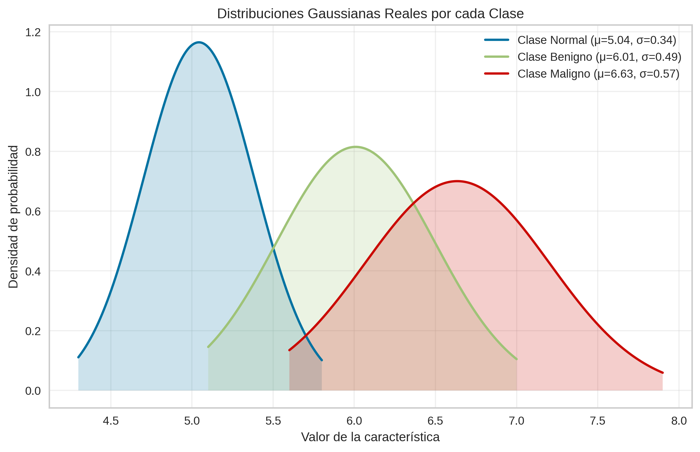
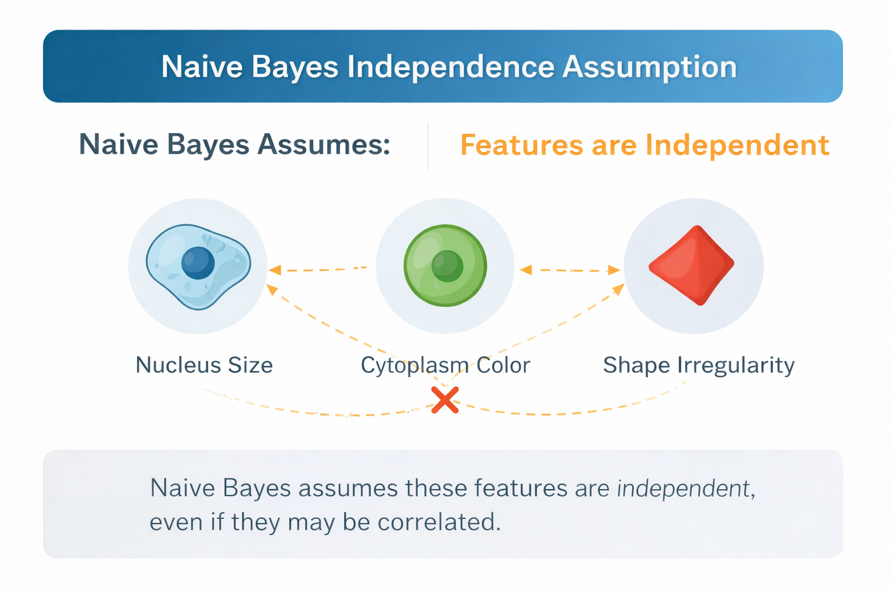

# Quinta-parte-de-documentaci-n-de-la-pr-ctica-Cell-Net-Evaluaci-n-de-modelos-
# Modelo Elegido - **Gaussian Naive Bayes**

He elegido este algoritmo ya que es un algoritmo de **clasificación supervisada** basada en el Teorema de Bayes.

Viene genial para una problemática como es la que nos encontramos que en la cual tiene poco datos y además es muy rápido.

## Funcionamiento del Algoritmo

El algoritmo de Gaussian Naive Bayes es un **clasificador probabilístico** que utiliza el teorema de Bayes para estimar la probabilidad de que una muestra pertenezca a cada una de las clases posibles y asignarla a la clase con mayor probabilidad.

Se utiliza la fórmula del **Teorema de Bayes:**

$$
P(C \mid X) = \frac{P(X \mid C) \cdot P(C)}{P(X)}​
$$
- C : La clase (Normal, Benigno o Maligno).
- X representa las características de la célula (diámetros de célula y núcleo).
- P (C) es la probabilidad de la clase (a priori).
- P (X | C) es la verosimilitud, Es la probabilidad de que cuando el modelo cataloga una célula a una clase tenga ciertas medidas determinadas (compatibilidad entre datos y clases)
- P (X) - Es la evidencia o la probabilidad marginal, actúa como normalizador se puede llega a omitir.

### 1.1 Probabilidad a priori - P(C) - Conocimiento previo

Representa la frecuencia de cada clase en el conjunto de entrenamiento, sería por así decirlo "conocimiento previo" representa que tan común es cada clase en nuestro set de datos antes de mirar la célula actual
	Ejemplo si el 60 % de las células son benignas, entonces tenemos que :
		P(Benigno) = 0.6
	Esto significa que antes de observas los datos, el modelo ya considera más probable que una célula sea benigna.
	Influye porque si dos clases encajan igual con los datos, ganará la más frecuente.
### 1.2 Verosimilitud - Campana de Gauss.

Gaussian Naive Bayes asume que cada característica sigue una distribución normal(gaussiana) dentro de cada clase. Es decir, para cada clase, los valores de las características tienden a agruparse alrededor de un valor central, formando una típica _campana de Gauss_.

- Para cada característica calcula la media que es el valor típico o el centro de la campana
- Desviación estándar (que tan ancha es la campana): Indica cuánto se dispersa los valores respecto a la media y permite saber que tan bien encaja el valor observado con los valores típicos de una clase. Una campana más ancha implica mayor variabilidad, mientras que una más estrecha indica valores más concentrados.

### 1.3 Suposición de independencia - Naive

El algoritmo se le llama "ingenuo" porque asume que cada característica (diámetros de la célula total y del núcleo) no tiene relación con las demás.

Esto sería una incongruencia ya que el tamaño de la célula suele indicar si es maligna o no, el modelo sigue funcionando bien ya que:

- No necesita probabilidades exactas, solo que la clase correcta tenga la mayor probabilidad.
- Generaliza mejor cuando hay pocos datos, evitando el sobreajuste (overfitting)
- A pesar de su simplicidad, puede generar fronteras de decisión razonables
- Presenta un coste computacional bajo, siendo rápido y eficiente en memoria

## 2 Proceso de entrenamiento.

En esta fase, el modelo analiza el conjunto de datos de entrenamiento y construye un resumen estadístico por cada clase, que posteriormente utilizará para clasificar nuevas muestras.

El proceso de entrenamiento sigue el siguiente proceso:
- **Cálculo de probabilidades a prior**i:
	Se calcula la probabilidad a priori de cada clase (cuenta cuántas hay de cada tipo).
	- Se contabiliza cuántas muestras pertenecen a cada clase se divide entre el total de el total de muestras, así obtenemos la probabilidad inicial de cada clase.
- **Estimación de parámetros por clase y característica/Verosimilitud:**
	Para cada característica y cada clase se calcula:
	- Media (μ), representa el valor promedio.
	- Desviación estándar (σ), mide la dispersión de los datos.

## 3 Proceso de Predicción

Para una nueva muestra es decir cuando le damos una célula nueva al modelo hacemos lo siguiente:
1. **Nos encargamos de medir la célula (extracción de características)**: toma las 4 variables en este caso A,B,C y D.
2. **Compara con sus campanas:** Calcula cuanto encaja ese dato en la campana de Normal, Benigno y de Maligno.
3. **Incorporación de probabilidades a priori:** Cada verosimilitud se multiplica por la probabilidad previa de su clase.
4. **Decisión final:** La muestra se asigna a la clase con la probabilidad posterior más alta

## Ventajas e Inconvenientes

Unas de sus más importantes ventajas son:
- **Súper rápido:** Solo necesita calcular medias y desviaciones.
- **Buen rendimiento con pocos datos:** Funciona bien incluso con conjunto de datos pequeños.
- **Escalable**: Ya que maneja grandes capacidades de características con una enorme facilidad.

Algunas de las limitaciones que tiene tiene este algoritmo son los siguiente: 

- **Suposición de independencia:** Si las variables están muy correlacionadas, el rendimiento del modelo disminuye(siendo este su principal desventaja).
- **Suposición de normalidad:** Si los datos no siguen una campana de Gauss, el rendimiento cae considerablemente.
- **El problema del 0:** Si alguna clase no tiene ningún dato para una determinada característica, la probabilidad total se vuelve 0 (aunque se puede solucionar con técnicas de suavizado)

## Conclusión

Gaussian Naive Bayes es un algoritmo sencillo pero muy efectivo, perfecto para problemas de clasificación médica como el nuestro. Lo que lo hace especial es que no solo te dice qué clase es, sino que también te muestra **qué tan seguro está** de esa predicción — algo clave en diagnósticos médicos donde la certeza importa.

Además, funciona muy bien con pocos datos (algo habitual en medicina) y es súper rápido y económico en recursos. Esto lo convierte en una opción ideal para sistemas de apoyo al diagnóstico, especialmente cuando necesitas resultados rápidos o trabajas con recursos limitados.
